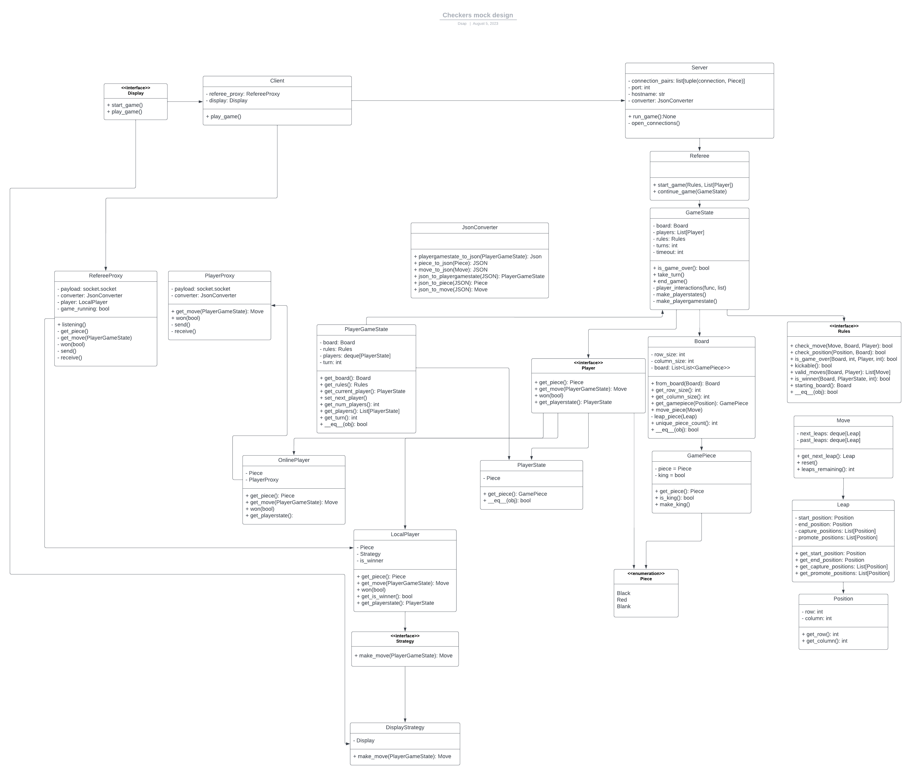
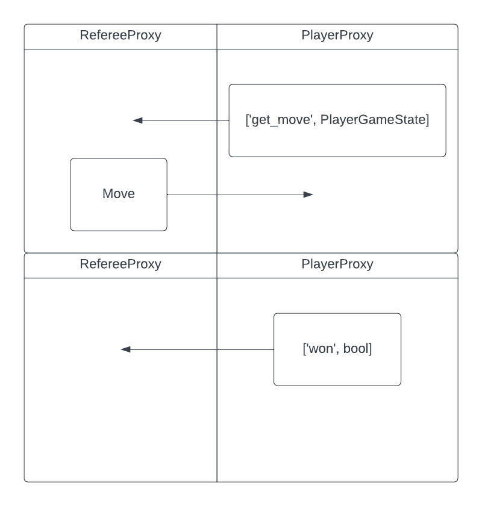

# CHECKERS

Its Checkers :) 

Just a simple project updated every once in awhile as I improve my software development skills.
The main goals of this project being to improve my Python software development skills.
This includes using new software, like Flask. 

Practice makes perfect.
Feel free to leave comments and help improve the professional and socially
responsible code I write.

# Project Design

This mock represents the software design for this project. 

The key features for this mock were:
1. Support Remote Connections
2. Support AI players (Strategies that do not use client input)
3. Leave room for future front end development

With these features in mind the above mock was made. The idea is to have a Referee that contains information about a GameState, Rules, and Players. With this it can ask players to make moves, validate the moves against the rules, then apply the move to the GameState, then update the players with the new GameState. 

This will allow for easy expansion and updates to the game. For special verizons or rule updates all you have to do is update the Rules object without needing to update the GameState. 

Proxies will be used to facilitate communicate between the Client and Server. The Player object will be on the server side and have a PlayerProxy object that allows it to communicate to the Client. The Client will use the RefereeProxy to communicate back. 

The Strategy object will be used to determine the next move for the player. I.e whether its user input from the client or an AI. The use of AI will come in handy for automated testing.

# Referee-Player Proxy Communications

Player - Referee communication proxies will use JSONs through JsonConverter

There will be 3 things to be send through proxies

A PlayerProxy is a proxy that allows the game to talk to the player.
A RefereeProxy is a proxy that allows the player to talk to the referee.

JSON Communication Guide

# TODO

1a. Ensure a server does not get 2 clients asking for the same piece.
1b. OR Should clients tell servers their piece or should servers give the piece to the client
2. GRAPHICS BABY
3. Should server need to make the rules object before giving it to referee?
4a. Improve READMEs, Update diagrams and design pngs (includes making a guide to how a game works)
4b. Create information as to why online player stores piece locally
5. Instance checking on parameters? What is the best practice
6. Should Move return copies of the Position? Is this a vulnerability if not.
7. Add makefile, just needs pytest
8. (Optional) Research and implement optional typing for the use of GamePiece
9. Should typing be done through strings and not imports (this can help with circular imports?)

# Directories

|   Location     |   About   |
|   :---         |   :---     |
| [resources](./resources/README.md) | Represents information about the project.
| [src](./src/README.md) | source code for the project |
| [testing](./testing/README.md) | testing for the project |