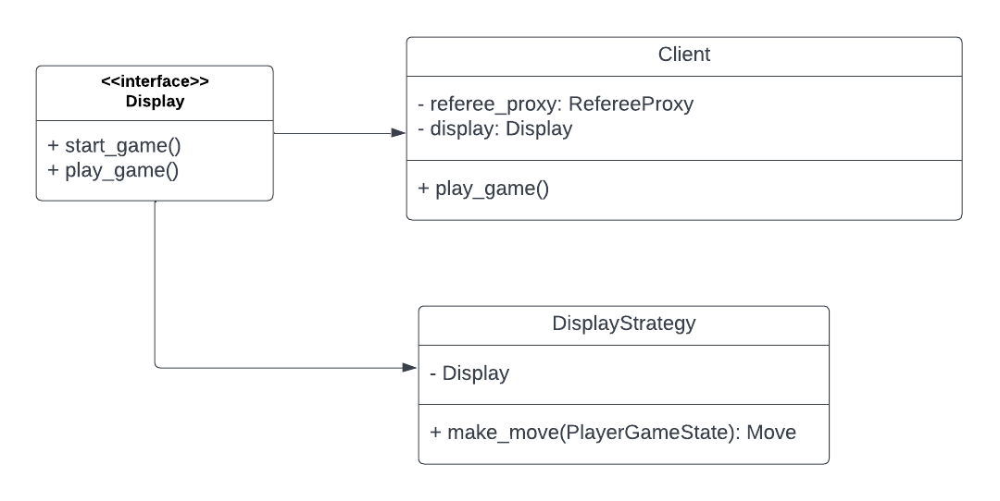

# client

Client directory represents the code needed to connect to a server of checkers
and play a game.

# Design

The design for displays is such that the client will own a refereeproxy which
owns a player. That player will use a strategy that connects to the display. 
This allows the display to send the strategy information from the player and 
display updates on the strategies moves during a game.

# Starting a game

# Directory 
| File or Folder | About |
| ---            | ---   |
| [client.py](./client.py) | [Client](./client.py) |
| [displays](./displays/README.md) | Displays