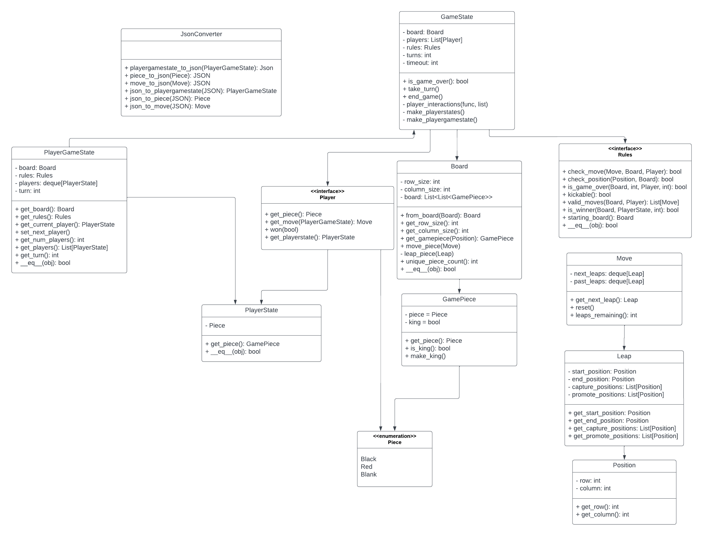

# common

common represents common knowledge about the game. 

# Design

Above is the design for the common directory. Since the common directory represents the common knowledge about the game this includes the GameState and everything it makes up, along with the Rules.

# Directory 
| File or Folder | About |
| ---            | ---   |
| [gamepiece.py](gamepiece.py) | GamePiece
| [position.py](position.py) | Position
| [board.py](board.py) | Board
| [move.py](move.py) | Move
| [player.py](player.py) | Player
| [gamestate.py](gamestate.py) | GameState