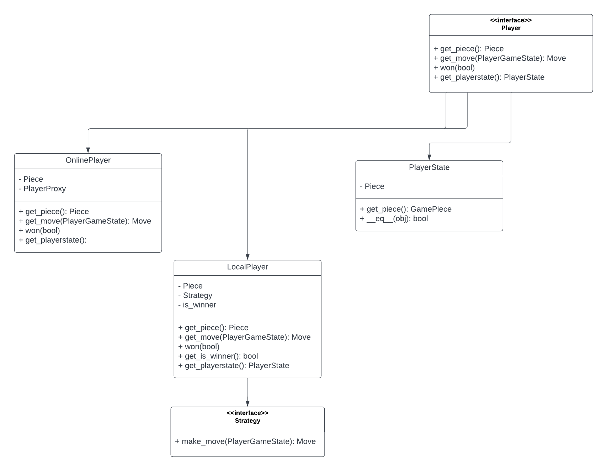

# player

Player directory represents the knowledge the and components the player needs or will use.

# Design

Above is the design for the player directory.

# Directory 
| File or Folder | About |
| ---            | ---   |
| [strategy.py](./strategy.py) | [Strategy](./strategy.py) |
| [simplestrategy.py](./simplestrategy.py) | [SimpleStrategy](./simplestrategy.py) |