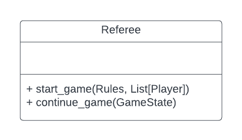

# referee

Referee directory represents the knowledge the and components the referee needs or will use.
This makes up the knowledge needed to run a game that isn't needed by the 
player.

# Design

# Directory 
| File or Folder | About |
| ---            | ---   |
| [localplayer.py](./localplayer.py) | [LocalPlayer](./localplayer.py) |
| [strategies](./strategies/README.md) | Contains strategies. |