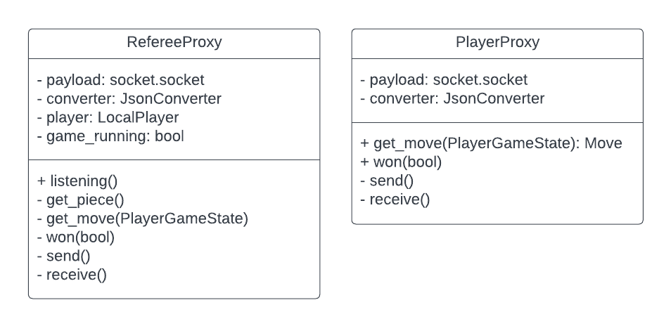

# remote

Remote directory contains the information needed to run proxies to allow 
remote connections.

# Design

# Referee-Player Proxy Communications

Player - Referee communication proxies will use JSONs through JsonConverter

There will be 3 things to be send through proxies

A PlayerProxy is a proxy that allows the game to talk to the player.
A RefereeProxy is a proxy that allows the player to talk to the referee.

JSON Communication Guide

# Directory 
| File or Folder | About |
| ---            | ---   |
| [playerproxy.py](./playerproxy.py) | PlayerProxy |
| [refereeproxy.py](./refereeproxy.py) | RefereeProxy |