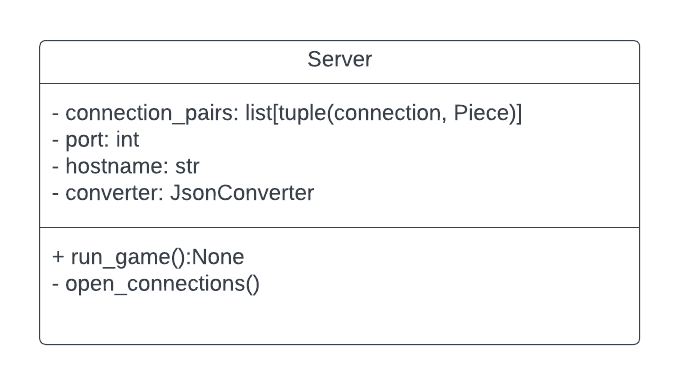

# server

Server directory repsents the code needed to spin up a server of checkers 
for clients to connect to.

# Design

# Starting a game

# Directory 
| File or Folder | About |
| ---            | ---   |
| [server.py](./server.py) | [Server](./server.py) |